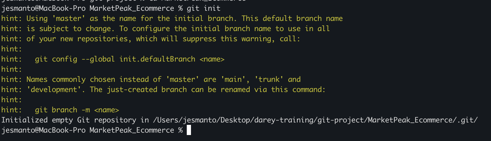
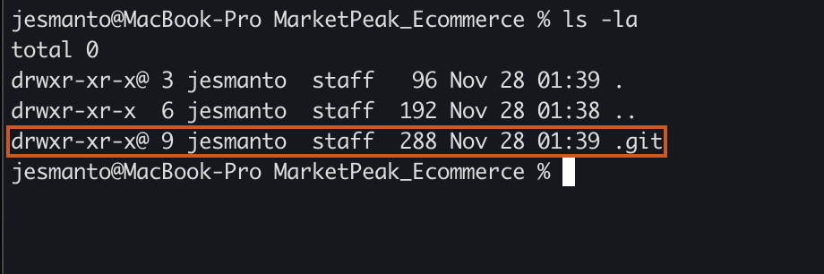
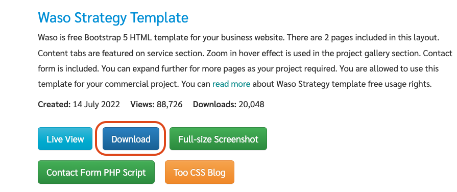
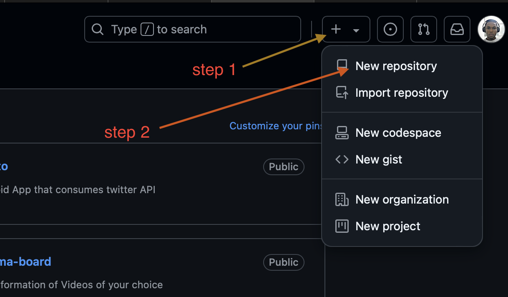
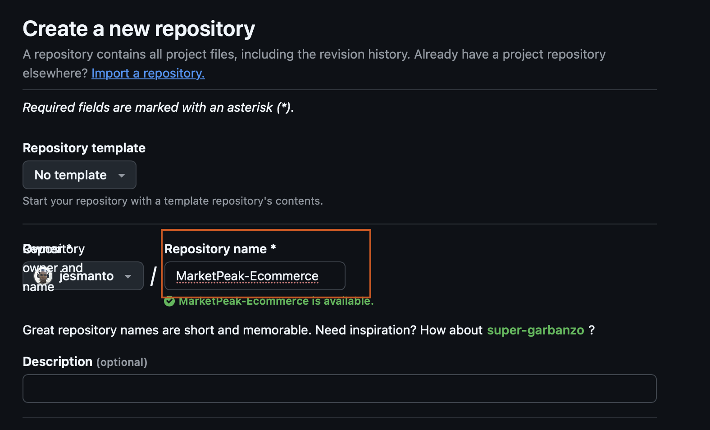

# Market Peak ECommerce
This platform will feature product listing, a shopping cart and user authentication.

## Step 1 - Implement Version Control with Git
### 1.1. Initialize Git Repository
- Open the terminal on your local machine.
- Navigate to your preferred location.
- Create a directory named "MarketPeak_Ecommerce" by using the command `mkdir MarketPeak_Ecommerce`.
- Navigate into the new directory by using `cd MarketPeak_Ecommerce`.
- Inside the new director, call the git command `git init` to initialize git in the directory.

    

- You should see a `.git` file when you ls into the directory using `ls -la`

    

### 1.2. Obtain and Prepare the E-commerce Website Template
Rather than building a wesite from scratch, you can use pre-built debsite templates, and focus on the operational and deployment aspects. You can get these templates for free online. Let's get started.
- Download the [Waso Strategy HTML Template
](https://www.tooplate.com/view/2130-waso-strategy) from tooplate wesite.
    - On the page, scroll down a little, you'll find the download button.
    - Click on the download button and select the destination folder.
    
- Extract the downloaded template into your project directory, _**MarketPeak_Ecommerce**_. In my case, I used a linux comman to do that.

    `unzip -d ./  ~/downloads/2130_waso_strategy.zip`

### 1.3. Stage and Commit the Template to Git
- Add you project files to your local repository staging area. `git .`
- Set your git global configuration repository with your username and email address.

    ```
    git config --global user.name "YourUsername"
    git config --global user.email "youremail@example.com"
    ```
- Commit your changes with a descriptive message of what you did.

    `git commit -m "Initial commit with basic e-commerce site construction`

### 1.4. Push the code to your Github repository

Before we can push to github, we need to create a remote repository using the same name as the local repostory. Here's how to go about it.
- Log into you [github](https://github.com) account.
- Click on the '+' icona at the top-right corner, and select '**New repository**'.

    

- Provide the name and description of the repository, and you're done with that.

    