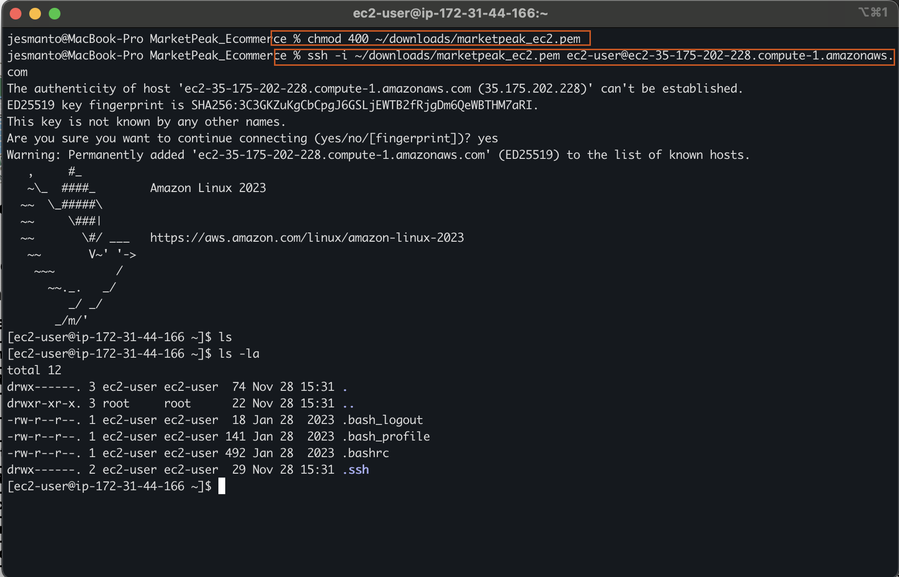
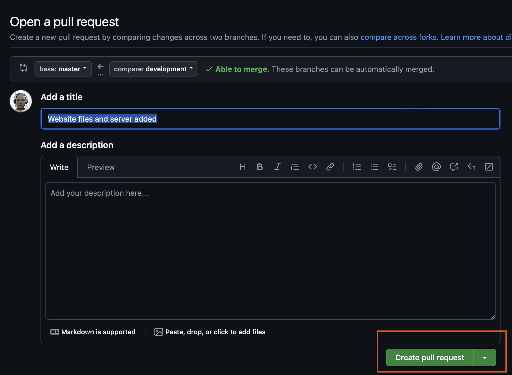

# Market Peak ECommerce
This platform will feature product listing, a shopping cart and user authentication.

## Step 1 - Implement Version Control with Git
### 1.1. Initialize Git Repository
- Open the terminal on your local machine.
- Navigate to your preferred location.
- Create a directory named "MarketPeak_Ecommerce" by using the command `mkdir MarketPeak_Ecommerce`.
- Navigate into the new directory by using `cd MarketPeak_Ecommerce`.
- Inside the new director, call the git command `git init` to initialize git in the directory.

    

- You should see a `.git` file when you ls into the directory using `ls -la`

    

### 1.2. Obtain and Prepare the E-commerce Website Template
Rather than building a wesite from scratch, you can use pre-built debsite templates, and focus on the operational and deployment aspects. You can get these templates for free online. Let's get started.
- Download the [Waso Strategy HTML Template
](https://www.tooplate.com/view/2130-waso-strategy) from tooplate wesite.
    - On the page, scroll down a little, you'll find the download button.
    - Click on the download button and select the destination folder.
    
- Extract the downloaded template into your project directory, _**MarketPeak_Ecommerce**_. In my case, I used a linux comman to do that.

    `unzip -d ./  ~/downloads/2130_waso_strategy.zip`

### 1.3. Stage and Commit the Template to Git
- Add you project files to your local repository staging area. `git .`
- Set your git global configuration repository with your username and email address.

    ```
    git config --global user.name "YourUsername"
    git config --global user.email "youremail@example.com"
    ```
- Commit your changes with a descriptive message of what you did.

    `git commit -m "Initial commit with basic e-commerce site construction`

### 1.4. Push the code to your Github repository

Before we can push to github, we need to create a remote repository using the same name as the local repostory. Here's how to go about it.
- Log into you [github](https://github.com) account.
- Click on the '+' icona at the top-right corner, and select '**New repository**'.

    

- Provide the name and description of the repository, and you're done with that.

    

- Link the local repository to the just-created remote repository. For me I used 

    `git remote add origin git@github.com:jesmanto/MarketPeak-Ecommerce.git`

- Push your project to github

    `git push -u origin main`

    >For me, I used `master` because `main` did not work.

- Confirm this action by going back to the github repository and refresh the page. As you can see in the image below.

    

That concludes the implementation of Version Control with Git. Next is AWS Deployment

## Step 2 - AWS Deployment
To deploy our **MarkeatPeak_Ecommerce**, we need to set up an instance of Amazon EC2 server. Let's go:

### 2.1. Set up an AWS EC2 Instance
- #### Log in to [AWS Management Console](https://eu-north-1.signin.aws.amazon.com/oauth?client_id=arn%3Aaws%3Asignin%3A%3A%3Aconsole%2Fcanvas&code_challenge=CZ35RDE4OJEepZd5d5YUp8sLB9peYH9cnZ7lro62xkU&code_challenge_method=SHA-256&response_type=code&redirect_uri=https%3A%2F%2Fconsole.aws.amazon.com%2Fconsole%2Fhome%3FhashArgs%3D%2523%26isauthcode%3Dtrue%26nc2%3Dh_ct%26src%3Dheader-signin%26state%3DhashArgsFromTB_eu-north-1_f8a4026cc6f71bb1)

    

- #### Launch an EC2 instance using an Amazon Linux AMI
    - Search for E2 service and open it. Click on instances to select from the list of instances available. 
    - Or you can create a new instance by clicking in `Launch a Instance`. See the image below.

        

    - Provide the name of the new EC2 web server.
    - Select Amazon Linux for the list of **Application and OS Images** 
    - Select **Amazon Linux 2023 AMI** from the **Amazon Machine Image** dropdown.

        

    - Select any free tier eligible Instance type from the dropdown list of Instance types.

    - Click on `Create new key pair` under the **Key Pair (Login) section**, and create a new key pair following the steps in the image below.

        

    - Select `Create security group` under network settings, and allow SSH traffic from anywhere. check the image below.

        
    - Leave every other settings in their default state and Click `Launch Instance`. And you're done.

- #### Connect to the instance using SSH
    - Click on the instance id on the success page.
        
    
    - Select the new EC2 instance and click on `Connect`

        
    
    - That takes you to a page where you're given instructions on how to connect. See image below.

        

    - For me, the first step is to open my terminal. Then modify the user permission (`chmod 400 ~/marketpeak_ec2.pem`) to allow only the user have read and execute permissions, while group and others have no permissions at all, for the private key I recently downloaded. Then connect to the EC2 instance through my public DNS. See image below for details.

        

### 2.2. Clone the repository on the Linux Server
We need to clone the e-commerce platform githuhub repository to the AWS EC2 instance using the **SSH** method. The steps are as follows.
#### Generate SSH keypair on EC@ instance using ssh-keygen


#### Display and Copy your public key


#### Go to github and open settings page
On github, click on your profile image at the top-right corner, then click on Settings.


#### Click on SSH and GPG keys
Then click on `New SSH Key`


#### Provide a name for the Key and paste the key you cooied from your terminal.


`Add SSH Key` and you're done.

#### Clone the repository
Go back to the ecommerce repository on your github, click on code, copy the SSH code and head to your terminal.


#### Clone the repository on your terminal
Clone the repository by using the command `git clone git@github.com:yourusername/MarketPeak_Ecommerce.git`

Oops! There was a error `-bash: git: command not found`


This can be resolved by updating the packages and installing git on the EC2 instance using the following command
```
sudo yum update -y
sudo yum install git -y
sudo git --version 
```


Configure you git using the following command

```
git config --global user.name “Your Name”
git config —-global user.email “your_email@example.com”
```

> **Now you can try cloning again**


### 2.3. Install a Web Server on EC2
I installed **_Apache HTTP Server (httpd)_**, which  is a widely used web server that serves HTML files and content over the internet. 

Before we begin the installation, we need to create a `development` branch on git, so that the main branch will not be tampered. Use this command to achieve that:

``` 
cd MarketPeak-Ecommerce
git checkout -b development 
```


**NB: Before installing any package, make eure to update yum to ne sure that all dependencies are up-to-date. Then go ahead and install the package**

Use:
```
sudo yum update -y
sudo yum install httpd -y
```
**After installing Apache Web Server, start and enable the server**

```
sudo systemctl start httpd
sudo systemctl enable httpd
```


### 2.4. Configure httpd for Website
**httpd** needs to be configured to point to the directory on Linus server where the website code files are stored. Usually in /var/www/html
- Prepare the Web directory by clearing the default httpd web directory and copying MarketPeak Ecommerce website files to it.

    ```
    sudo rm -rf /var/www/html/*
    sudo cp -r ~/MarketPeak_Ecommerce/* /var/www/html/
    ```
    > NOTE: Do not forget to add the **-r** flag. It indicates that there are other sub-directories in the directory.


- Reload httpd service to apply changes
    ```
    sudo systemctl reload httpd
    ```

### 2.5. Access Website from Browser
- Go back to AWS EC2 instance and copy the **public IPV4 Address**
- Open your web browser, and paste the address you copied

    

## 3. Continuous Integration and Deployment Workflow
#### Developing New Feature and Fixes
- Create a Development branch: Creating a separate branch helps isolate new features and bug fixes from the stable version of your website. The command below creates and switches to a new branch.

    ```
    git checkout -b development
    ```
- Version Control on Git
    - Add the changes made to the staging area in git.

        ```
        git add .
        ```
    - Add the changes to the checkout point by committing your changes with a suitable message

        ```
        git commit -m "website files and server added"
        ```
    
    - Push to Github

        ```
        git push origin development
        ```

- Pull Requests and Merging
    - Head over to github and refresh your repository's page.
    - Click on `Compare and pull request`.

        
    - Add an optional description
    - Click on `Create Pull Request`

        

    - Review the changes made and merge if no conflicts. 

        

    - Head back to the terminal and switch back to the main branch with the following command
        ```
        git checkout master
        ```
    - Merge development branch with master branch
        ```
        git merge development
        ```
    - Push the Merged changes to github
        ```
        git push origin master
        ```
> And you are done.
